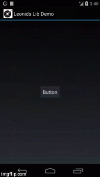
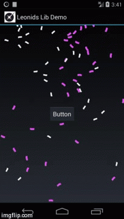

Leonids
==========================

Leonids is a particle system library that works with the standard Android UI.

The library is extremely lightweight, [LeonidsLib.jar](https://github.com/plattysoft/Leonids/releases/download/1.1.1/LeonidsLib.jar) is just 18Kb you can add to your project.

You can download [Leonids Demo from Google Play](https://play.google.com/store/apps/details?id=com.plattysoft.leonids.examples) to check out what can be done with it.

## Why this library?

Particle systems are often used in games for a wide range of purposes: Explosions, fire, smoke, etc. This effects can also be used on normal apps to add an element of "juiciness" or Playful Design.

Precisely because its main use is games, all engines have support for particle systems, but there is no such thing for standard Android UI.

This means that if you are building an Android app and you want a particle system, you have to include a graphics engine and use OpenGL -which is quite an overkill- or you have to implement it yourself.

Leonids is made to fill this gap, bringing particle sytems to developers that use the standard Android UI.

## Basic usage

Creating and firing a one-shot particle system is very easy, just 3 lines of code.

```java
new ParticleSystem(this, numParticles, drawableResId, timeToLive)
.setSpeedRange(0.2f, 0.5f)
.oneShot(anchorView, numParticles);
```

When you create the particle system, you tell how many particles will it use as a maximum, the resourceId of the drawable you want to use for the particles and for how long the particles will live.

Then you configure the particle system. In this case we specify that the particles will have a speed between 0.2 and 0.5 pixels per milisecond (support for dips will be included in the future). Since we did not provide an angle range, it will be considered as "any angle".

Finally, we call oneShot, passing the view from which the particles will be launched and saying how many particles we want to be shot.



## Emitters

You can configure emitters, which have a constant ratio of particles being emited per second.
This is the code for the Confeti example:

```java
new ParticleSystem(this, 80, R.drawable.confeti2, 10000)
.setSpeedModuleAndAngleRange(0f, 0.3f, 180, 180)
.setRotationSpeed(144)
.setAcceleration(0.00005f, 90)
.emit(findViewById(R.id.emiter_top_right), 8);

new ParticleSystem(this, 80, R.drawable.confeti3, 10000)
.setSpeedModuleAndAngleRange(0f, 0.3f, 0, 0)
.setRotationSpeed(144)
.setAcceleration(0.00005f, 90)
.emit(findViewById(R.id.emiter_top_left), 8);
```

It uses an initializer for the Speed as module and angle ranges, a fixed speed rotaion and extenal acceleration.



## Available Methods

List of the methods available on the class ParticleSystem.

### Constructors

All constructors use the activity, the maximum number of particles and the time to live. The difference is in how the image for the particles is specified. 

Supported drawables are: BitmapDrawable and AnimationDrawable.

* _ParticleSystem(Activity a, int maxParticles, int drawableRedId, long timeToLive)_
* _ParticleSystem(Activity a, int maxParticles, Drawable drawable, long timeToLive)_
* _ParticleSystem(Activity a, int maxParticles, Bitmap bitmap, long timeToLive)_
* _ParticleSystem(Activity a, int maxParticles, AnimationDrawable animation, long timeToLive)_

### Configuration

Available methods on the Particle system for configuration are:

* _setSpeedRange(float speedMin, float speedMax)_: Uses 0-360 as the angle range
* _setSpeedModuleAndAngleRange(float speedMin, float speedMax, int minAngle, int maxAngle)_
* _setSpeedByComponentsRange(float speedMinX, float speedMaxX, float speedMinY, float speedMaxY)_
* _setInitialRotationRange (int minAngle, int maxAngle)_
* _setScaleRange(float minScale, float maxScale)_
* _setRotationSpeed(float rotationSpeed)_
* _setRotationSpeedRange(float minRotationSpeed, float maxRotationSpeed)_
* _setAcceleration(float acceleration, float angle)_
* _setFadeOut(long milisecondsBeforeEnd, Interpolator interpolator)_: Utility method for a simple fade out effect using an interpolator
* _setFadeOut(long duration)_:Utility method for a simple fade out

For more complex modifiers, you can use the method _addModifier(ParticleModifier modifier)_. Available modifiers are:

* _AlphaModifier (int initialValue, int finalValue, long startMilis, long endMilis)_
* _AlphaModifier (int initialValue, int finalValue, long startMilis, long endMilis, Interpolator interpolator)_
* _ScaleModifier (float initialValue, float finalValue, long startMilis, long endMilis)_
* _ScaleModifier (float initialValue, float finalValue, long startMilis, long endMilis, Interpolator interpolator)_

### One shot

Make one shot using from the anchor view using the number of particles specified, an interpolator is optional

* _oneShot(View anchor, int numParticles)_
* _oneShot(View anchor, int numParticles, Interpolator interpolator)_

### Emitters

Emits the number of particles per second from the emitter. If emittingTime is set, the emitter stops after that time, otherwise it is continuous.

* _emit (View emitter, int particlesPerSecond)_
* _emit (View emitter, int particlesPerSecond, int emittingTime)_

## Other details

Leonids requires minSDK 11 because it uses ValueAnimators. It should be very easy, however to use the compatibility library and make it work on Gingerbread.

The library is Free Software, you can use it, extended with no requirement to open source your changes. You can also make paid apps using it.

Each Particle System only uses one image for the particles. If you want different particles to be emitted, you need to create a Particle System for each one of them.
